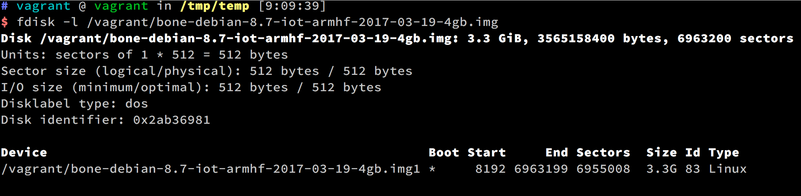

## Mount `img` file in Linux

1. Check 'disk' structure by `fdisk -l XXX.img`:
   

2. Calculate the offset: `offset = SECTOR_SIZE * START_UNIT`
   The offset in the example: `offset = 512 * 8192` and mount it with the parameters:

   ```sh
   sudo mount -t auto -o loop,offset=xxxxx XXX.img /tmp/MOUNT_POINT
   ```

   
