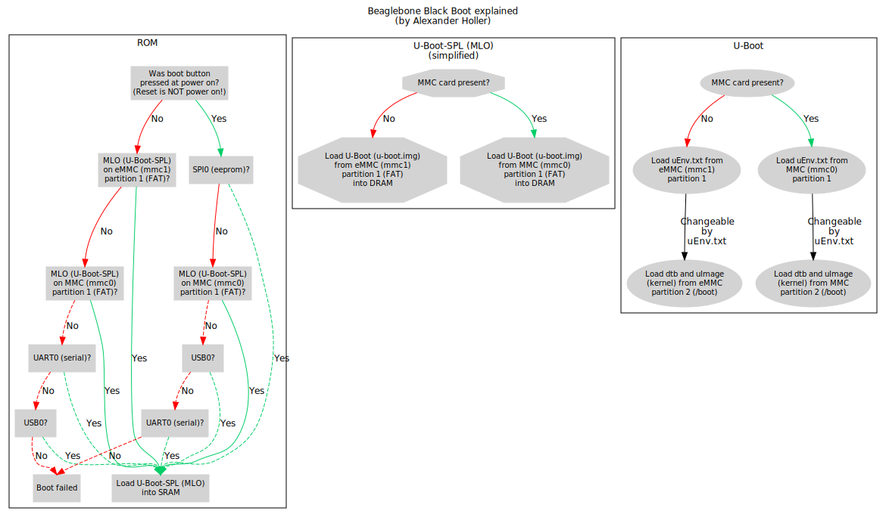

# introduction
This document explain the detail of uEnv.txt for [uboot] based on my experience in the past two weeks on the [BeagleBone Black].
U-boot: the Universal Boot Loader.

##Beaglebone Black booting sequence

[uboot]:http://www.denx.de/wiki/DULG/Manual
[BeagleBone Black]:http://www.denx.de/wiki/DULG/Manual
